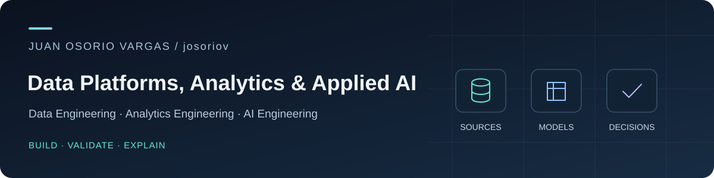

  

  <strong>MSc in Computational Science</strong> — Universität Regensburg 
  <strong>BSc in Physics</strong> — Universidad de los Andes

  Bogotá, Colombia · Spanish (native) · English (C1) · German (C1) 
  <a href="https://www.linkedin.com/in/juanferov/">LinkedIn</a> · <a href="mailto:jfosorio.dev@gmail.com">Email</a>

I'm **Juan Osorio Vargas**, a data engineer with **5 years of experience** building and operating production data pipelines with Python, SQL, Spark, Airflow, and AWS. I've worked across data engineering, business analytics, and credit-risk modeling in Colombia and Germany.

I connect reliable pipelines to business metrics and useful AI workflows. My portfolio extends my production experience into **Analytics Engineering** and **AI Engineering**, with explicit business rules, reproducible setup, and inspectable results.

## Experience in practice

| Team | Selected work |
| :--- | :--- |
| **Wizeline** · Data Engineering | Owned an Airflow/Spark production pipeline processing **2+ TB/week**; migrated it to AWS MWAA while maintaining downstream delivery. Automated releases with AWS CDK and GitHub Actions. |
| **Krones AG** · Data Engineering | Built Python/SQL ETL for SAP and SharePoint exports, added dataset validation, and developed Power BI models and dashboards for operations in Europe and Central Asia. |
| **MO Technologies** · Data Science | Built credit-default models with scikit-learn, XGBoost, and PyTorch; monitored distribution drift and implemented lending-policy rules around predictions. |
| **Leal** · Data Science | Developed customer analytics with Python and SQL; reduced peak database CPU utilization by **30%** through scheduling and data-retrieval improvements. |

## Selected projects

### [Weather Pipeline](https://github.com/josoriov/weather-pipeline)

**Data Engineering · AWS · Infrastructure as code**

A serverless ETL pipeline that collects Open-Meteo weather observations for **14 cities**, preserves raw data in S3, and prepares processed datasets for SQL analysis through Glue and Athena.

- **Ingestion to analytics:** Python on Lambda, EventBridge scheduling, an S3 data lake, and a projected Glue table.
- **Reproducible infrastructure:** Terraform provisions the pipeline, permissions, catalog, and cost controls.
- **Operations:** batched writes, unit tests, type checks, GitHub Actions, and documented incident fixes.

**Stack:** Python · AWS Lambda · S3 · EventBridge · Glue · Athena · Terraform · GitHub Actions

[Explore the code](https://github.com/josoriov/weather-pipeline) · [Architecture and setup](https://github.com/josoriov/weather-pipeline/blob/main/setup.md)

Execution is currently paused to control cloud costs; the repository documents deployment and resumption.

### [NYC TLC Trips Analytics](https://github.com/josoriov/nyc-tlc-trips)

**Analytics Engineering · dbt · BigQuery · GCP**

A dbt project that turns public NYC yellow-taxi data into dashboard-ready views for citywide and pickup-zone analysis.

- **Analytical modeling:** staging, zone dimensions, enriched trips, and daily demand and revenue marts.
- **Data quality:** null, accepted-value, uniqueness, and relationship checks.
- **Cloud delivery:** Terraform provisions datasets and Workload Identity Federation; GitHub Actions parses pull requests and builds models on `main` and monthly.
- **Cost awareness:** logical views avoid storing transformed data, with a query-quota check in the authenticated build.

**Stack:** SQL · dbt · BigQuery · GCP · Terraform · GitHub Actions

[Explore the models](https://github.com/josoriov/nyc-tlc-trips) · [Deployment workflow](https://github.com/josoriov/nyc-tlc-trips/blob/main/.github/workflows/deploy.yml)

### [Marketplace Analytics](https://github.com/josoriov/marketplace-analytics)

**Analytics Engineering · dbt · PostgreSQL · FastAPI**

A local analytics project that turns the Olist Brazilian e-commerce dataset into a PostgreSQL warehouse and an API for seller, category, and regional sales metrics.

- **Ingestion to business metrics:** Python and Polars validate nine CSVs; dbt builds raw, silver, and analytics layers with explicit revenue and delivery rules.
- **Data quality:** 45 dbt tests and 42 Python tests cover model grains, revenue reconciliation, API contracts, and PostgreSQL metric regression; GitHub Actions runs lint and regression checks.
- **Inspectable results:** documented sales, seller concentration, and delivery findings, with model lineage, an interactive architecture diagram, and a reproducible container setup.

**Stack:** Python · SQL · Polars · PostgreSQL · dbt · FastAPI · uv · Docker/Podman · GitHub Actions

[Explore the code](https://github.com/josoriov/marketplace-analytics) · [Analytics and example results](https://github.com/josoriov/marketplace-analytics/blob/main/docs/analytics.md) · [Architecture and setup](https://github.com/josoriov/marketplace-analytics/blob/main/README.md#architecture)

### [AI & Data Systems Lab](https://github.com/josoriov/ai-data-systems-lab)

**Analytics Engineering · AI Engineering · Consumer lending**

Two complementary local prototypes for a fictional lending company, using synthetic data and example policies.

**Lending analytics warehouse**

- **Bronze → Silver → Gold** warehouse with Python, SQL, dbt, and DuckDB.
- CDC normalization, identity resolution, payment reversals, SCD2 merchant history, and FIFO allocation.
- Merchant performance and delinquency metrics, validated with **49 dbt tests**.

**AI customer-message triage**

- Spanish message classification and entity extraction through structured outputs and Pydantic.
- Deterministic human routing and replies grounded in reviewed policy templates.
- Inspectable output for **340 sample messages** and offline tests for routing boundaries.

**Stack:** Python · SQL · dbt · DuckDB · OpenAI SDK · Pydantic

[Explore the code](https://github.com/josoriov/ai-data-systems-lab) · [Architecture and setup](https://github.com/josoriov/ai-data-systems-lab/blob/main/README.md)

## Toolkit

| Area | Tools and practices |
| :--- | :--- |
| Data engineering | Python, SQL, Spark/PySpark, Airflow, AWS Glue, S3, Athena, MWAA, AWS CDK, Terraform, GitHub Actions |
| Analytics engineering | dbt, BigQuery, DuckDB, dimensional modeling, CDC normalization, SCD2 history, data quality tests, Power BI, QuickSight |
| AI & machine learning | OpenAI SDK, Pydantic, structured outputs, human routing, pandas, scikit-learn, XGBoost, PyTorch, model monitoring |

**Education:** MSc in Computational Science, Universität Regensburg · BSc in Physics, Universidad de los Andes.

---

  Interested in working together on data platforms, analytics, or applied AI? 
  <a href="https://www.linkedin.com/in/juanferov/">Connect on LinkedIn</a> · <a href="mailto:jfosorio.dev@gmail.com">Get in touch</a>

